


 

 

<!-- ═══════════════════════════════ I ═══════════════════════════════ -->

 

**Hello, I'm Joseph Mulwa — and I see the internet brought you to me.** Smart move, internet. It usually just delivers cat videos and strong opinions about tabs versus spaces.

Here's the thing: I'm a **Fullstack JavaScript developer**. Genius? I wouldn't say that myself. *(Pause.)* I'd let the commit history say it. I build frontends that make designers cry — the good kind of crying — backends that stay upright when traffic shows up uninvited, and system designs that laugh at the phrase "just a small change request." No suit of armor. I've got a terminal, an unreasonable amount of opinions about clean code, and enough chai to power a small arc reactor.

Bugs? I don't *fix* them. I sit them down, have a mature conversation, and they see reason. Deadlines are suggestions with a dramatic soundtrack. Legacy code is archaeology — less treasure, more `// TODO: fix later (2019)`.

Every legend needs a **mission** and a **vision**. Mine came with fewer explosions than the other guy's:

<table>
<tr>
<td width="50%" valign="top">

&nbsp;**THE MISSION**

 

Turn ambitious ideas into **useful, expressive systems**. Clean code, sane architecture, tests that actually test — the kind of codebase the next maintainer opens and says *"thank you"* instead of drafting a restraining order. Make it work, make it beautiful, make it fast. In that order. Usually.

</td>
<td width="50%" valign="top">

&nbsp;**THE VISION**

 

A world where great software is **forged with obsessive craft and shipped everywhere** — where the work does the talking, the résumé takes a nap, and I'm the engineer teams call when the problem is hard, the deadline is rude, and the stack runs from pixel to database to pipeline.

</td>
</tr>
</table>

 

<!-- ═══════════════════════════════ II ═══════════════════════════════ -->

 

<table>
<tr>
<td width="60" valign="middle" align="center"></td>
<td valign="middle"><b>Who am I</b> Joseph Mulwa — a fullstack developer who turns ambitious ideas into working software.</td>
</tr>
<tr>
<td width="60" valign="middle" align="center"></td>
<td valign="middle"><b>Ask me about</b> </td>
</tr>
<tr>
<td width="60" valign="middle" align="center"></td>
<td valign="middle"><b>Currently forging</b>    &nbsp; Docker · Kubernetes · Jenkins — because a great app nobody can deploy is just a very expensive hobby.</td>
</tr>
<tr>
<td width="60" valign="middle" align="center"></td>
<td valign="middle"><b>How to reach me</b> 

</td>
</tr>
<tr>
<td width="60" valign="middle" align="center"></td>
<td valign="middle"><b>Know more about me</b> </td>
</tr>
</table>

 

<!-- ═══════════════════════════════ III ═══════════════════════════════ -->

 

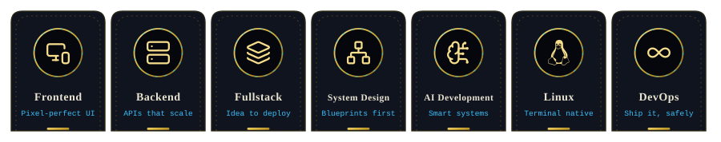

 

<!-- ═══════════════════════════════ IV ═══════════════════════════════ -->

 

 

 

<!-- ═══════════════════════════════ V ═══════════════════════════════ -->

 






 

<!-- ═══════════════════════════════ VI ═══════════════════════════════ -->

 




Charts are forged automatically from the GitHub API by a scheduled workflow — see <a href="scripts/generate-charts.mjs"><code>scripts/generate-charts.mjs</code></a>.

 

<!-- ═══════════════════════════════ VII ═══════════════════════════════ -->

 

<table>
<tr>
<th width="33%" align="center"> &nbsp;Frontend</th>
<th width="33%" align="center"> &nbsp;Backend</th>
<th width="33%" align="center"> &nbsp;Fullstack</th>
</tr>
<tr>
<td width="33%" valign="top">

<h4>🏛️ josephmulwa13 — Portfolio</h4>

My developer portfolio: a Next.js + TypeScript app with a component-driven architecture (shadcn/ui), built so first impressions do the heavy lifting.

   

 

</td>
<td width="33%" valign="top">

<h4>🗄️ freecodecamp — Relational Databases</h4>

Relational-database coursework from freeCodeCamp's curriculum: a "universe" SQL database (<code>universe.sql</code>) built around schema design, keys and table relationships.

</td>
<td width="33%" valign="top">

<h4>💸 ExpenseTracker</h4>

A full-stack expense tracker, split cleanly into a <code>Frontend</code> client and a <code>Backend</code> service, deployed and live on Vercel.

 

 

</td>
</tr>
<tr>
<td width="33%" valign="top">

<!-- TODO: replace with a real frontend project (name · description · repo link · live preview link) -->
<h4>🚧 Slot open — Frontend #2</h4>

<i>Reserved for the next masterpiece. Name, description, repository and live preview go here.</i>

</td>
<td width="33%" valign="top">

<!-- TODO: replace with a real backend project (name · description · repo link) -->
<h4>🚧 Slot open — Backend #2</h4>

<i>Reserved for a serious API. Name, description and repository link go here.</i>

</td>
<td width="33%" valign="top">

<!-- TODO: replace with a real fullstack project (name · description · repo link · live preview link) -->
<h4>🚧 Slot open — Fullstack #2</h4>

<i>Reserved for the next masterpiece. Name, description, repository and live preview go here.</i>

</td>
</tr>
<tr>
<td width="33%" valign="top">

<!-- TODO: replace with a real frontend project (name · description · repo link · live preview link) -->
<h4>🚧 Slot open — Frontend #3</h4>

<i>Reserved for the next masterpiece. Name, description, repository and live preview go here.</i>

</td>
<td width="33%" valign="top">

<!-- TODO: replace with a real backend project (name · description · repo link) -->
<h4>🚧 Slot open — Backend #3</h4>

<i>Reserved for a serious API. Name, description and repository link go here.</i>

</td>
<td width="33%" valign="top">

<!-- TODO: replace with a real fullstack project (name · description · repo link · live preview link) -->
<h4>🚧 Slot open — Fullstack #3</h4>

<i>Reserved for the next masterpiece. Name, description, repository and live preview go here.</i>

</td>
</tr>
</table>

 

<!-- ═══════════════════════════════ VIII ═══════════════════════════════ -->

 

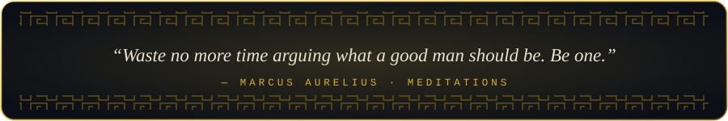

 

  

<i>Always write clean code — you never know if the person maintaining it is a psychopath.</i>


Thanks for stopping by. Star a repo on your way out — it's the polite thing to do. 🏛️

